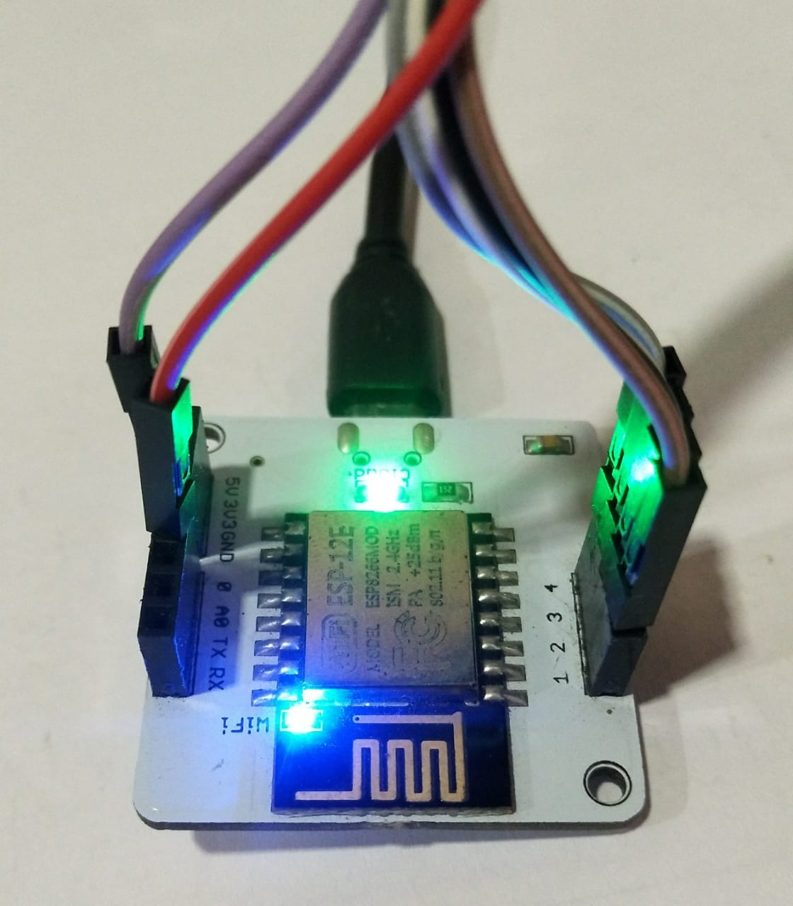
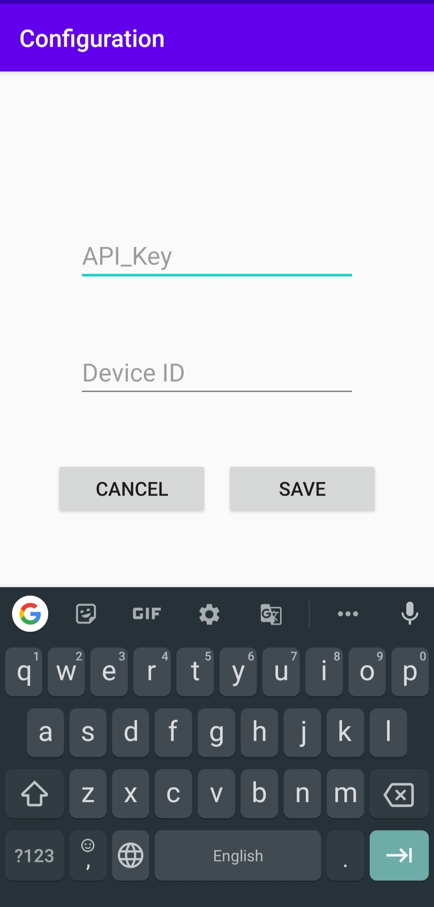
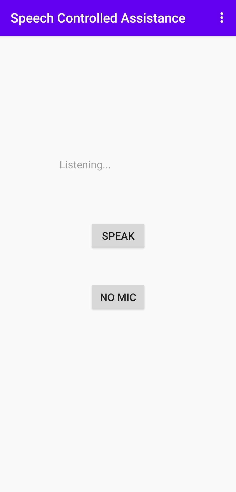
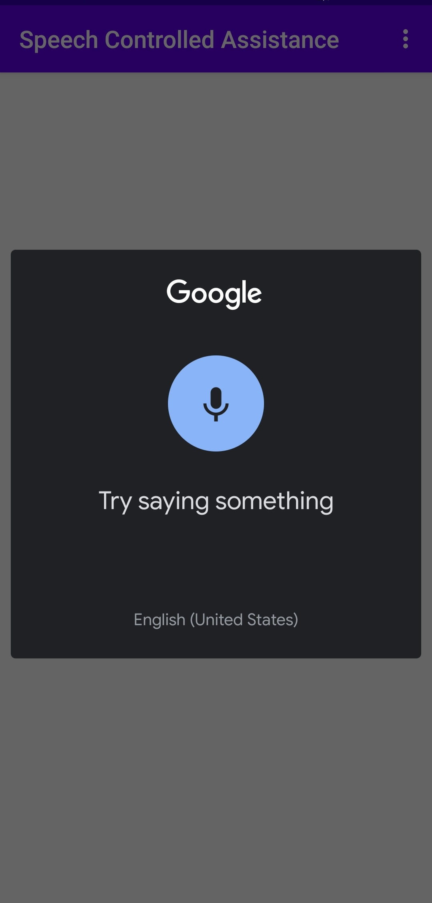
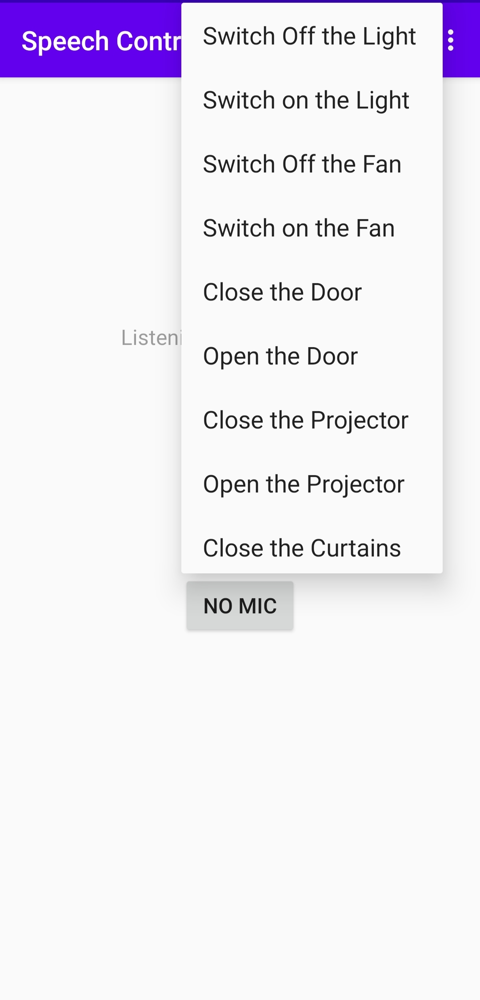

# Android-Voice-Controlled-Assistance

This is an Android Applications for Smart Classroom uses Speech Recognition to perform actions such as turning on/off ligths, etc.

We have used [Bolt WiFi Module](https://docs.boltiot.com/docs/bolt-wifi-module) for this project.

## Import Code on device
Refer [here](https://docs.boltiot.com/docs/import-example-code) for adding code on the device.
We've used 5 pins as follows to toggle state between `HIGH`/`LOW`:

| Pin No. | Appliance  Controlled |
|:-------:|:---------------------:|
|    0    |         Light         |
|    1    |          Fan          |
|    2    |          Door         |
|    3    |       Projector       |
|    4    |        Curtains       |

## Configuring

Refer [here](https://docs.boltiot.com/docs/device-info) to get Device Id.

 
<small>Configuration Intent</small>

# Android Application

    
     
    <small>(a) Main Intent (b) Speech Recognition. (c) No Mic. menu</small>

## Demo

https://user-images.githubusercontent.com/63636498/124931723-20468580-e020-11eb-8ce6-08d5f8451609.mp4&height=512

## Contributers

* Hardware: [Hadi Ali](https://github.com/hadiali2100)
* Android App: [Muhammed Abdullah](https://github.com/ABD-01)
